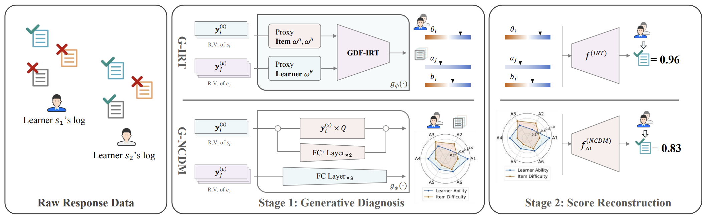
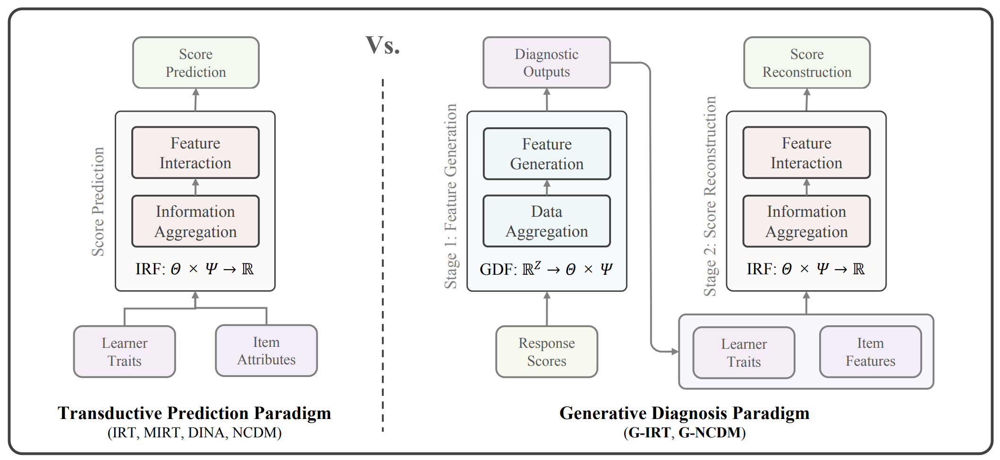

<div align="center">
  <h1 align="center">生成式认知诊断</h3>

  <p align="center">
    一个用于生成式（<strong>即时</strong>）认知诊断的代码库。
    <br />
    <a href="https://arxiv.org/abs/2507.09831"><strong>查看论文</strong></a>
    <br />
  </p>
</div>



## 关于本项目

生成式认知诊断是认知诊断（CD）任务中的一种新范式。与传统认知诊断模型（CDMs）通过可训练参数对学习者和试题进行建模不同，生成式认知诊断模型通过 **生成式诊断函数（GDFs）** 对学习者和试题进行建模。类比来看，生成式认知诊断模型是“编码器-解码器”模型，而传统认知诊断模型是“仅解码器”模型。



生成式认知诊断模型的编码器-解码器设计带来了两个重要优势：

- **无需为新学习者重新训练即可即时诊断**。当新学习者出现时，只需要将其作答得分输入到 GDF，并运行生成过程，就可以即时获得其认知状态估计，而不需要重新训练整个模型。
- **诊断输出的可靠性**。GDF 的潜在特质估计具有较强的可控性，因为可以方便地对 GDF 进行参数调节。这有助于更全面地理解响应数据与 GDF 生成的认知状态之间的可解释性和因果关系。

## 快速开始

### 安装

对于 G-IRT：

```bash
conda create -n girt python=3.10
conda activate girt
pip install -r ./GIRT/requirements.txt
```

对于 G-NCDM：

```bash
conda create -n gncdm python=3.10
conda activate gncdm
pip install -r ./GNCDM/requirements.txt
```

## 使用方法

### 训练

#### G-IRT

所有训练脚本都包含在 `GIRT/scripts/train*` 中。请记得将文件路径修改为你本地的路径。

#### G-NCDM

训练和拟合过程已经整合在一起。相关脚本包含在 `GNCDM/scripts/gncdm*` 中。

### 评估

#### G-IRT

所有评估脚本都包含在 `GIRT/scripts/eval*` 中。请记得将文件路径修改为你本地的路径。

#### G-NCDM

训练和拟合过程已经整合在一起。相关脚本包含在 `GNCDM/scripts/gncdm*` 中。

### 即时诊断

我们保存了生成式认知诊断模型的检查点，便于在 ASSIST 和 Math1 数据集上快速开始即时诊断。

#### G-IRT

请参考 `GIRT/scripts/diagnose*`。

#### G-NCDM

请参考 `G-NCDM/scripts/gncdm_*_diagnose.sh`。

